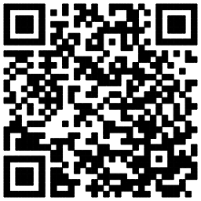

dragloader.js
==========

dragloader.js是一个面向移动Web开发的JavaScript库，帮助开发者在使用页面原生滚动时，模拟上/下拉手势，实现Pull to Request操作。

在移动设备上，一般会使用 pull down 手势实现加载最新

使用 pull up 手势实现加载更多

dragloader样例需运行在 Smart Phone/Pad 上，扫描二维码：

另一个样例，IScroll与dragloader.js的实现Pull to Request对比:

使用IScroll实现： http://jsbin.com/AtIGeKe/latest

使用dragloader.js的实现： http://jsbin.com/UGajALA/latest

## Options

**Boolean : disableDragDown** true禁用下拉操作

**Boolean : disableDragUp** true禁用上拉操作

**Number : threshold** 默认上/下拉区域临界值，超过这个值状态将由“default”变为“perpare”，默认80

**Number : dragDownThreshold** 下拉区域临界值，超过这个值状态将由“default”变为“perpare”

**String : dragUpThreshold** 上拉区域临界值，超过这个值状态将由“default”变为“perpare”

**String : dragDownRegionCls** 下拉区域样式

**String : dragUpRegionCls** 上拉区域样式

**Function : dragDownHelper( String status )** 下拉区域html更新函数，需要根据不同状态返回html碎片，status取值范围：'default'、'prepare'、'load'

**Function : dragUpHepler( String status )** 上拉区域html更新函数，需要根据不同状态返回html碎片，status取值范围：'default'、'prepare'、'load'

**Boolean : preventDragHelper** 禁用dragHelper，由外部控制dragHelper

**Function : beforeDrag()** drag开始回调函数，返回false时，本次drag动作将失效

**Function : onDragDownDefault()** 当下拉区域drag状态更新为'default'时触发

**Function : onDragDownPrepare()** 当下拉区域drag状态更新为'prepare'时触发

**Function : onDragDownLoad()** 当下拉区域drag状态更新为'load'时触发

**Function : onDragUpDefault()** 当上拉区域drag状态更新为'default'时触发

**Function : onDragUpPrepare()** 当上拉区域drag状态更新为'prepare'时触发

**Function : onDragUpLoad()** 当上拉区域drag状态更新为'load'时触发

## Methods

**Function : setDragDownDisabled(Boolean disabled)** 设置下拉区域禁用状态

**Function : setDragUpDisabled(Boolean disabled)** 设置上拉区域禁用状态

**Function : reset()** 重置drag状态。无论何时，必须由业务功能主动调用reset()接口，以还原状态。比如在onDragDownLoad()回调中使用ajax加载数据时，在ajax的回调函数中应当调用reset()重置drag状态。如果不重置，drag操作将失效.
